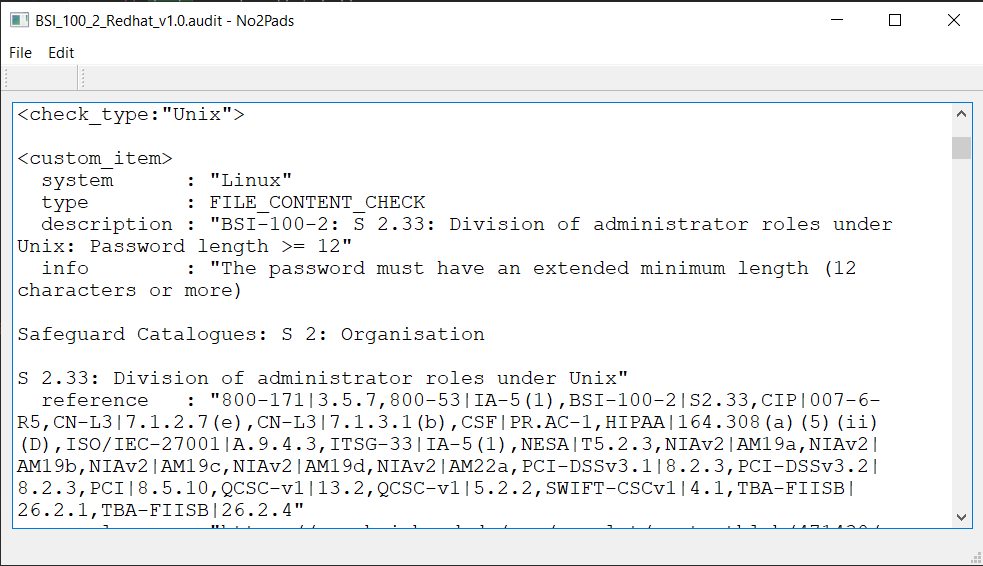
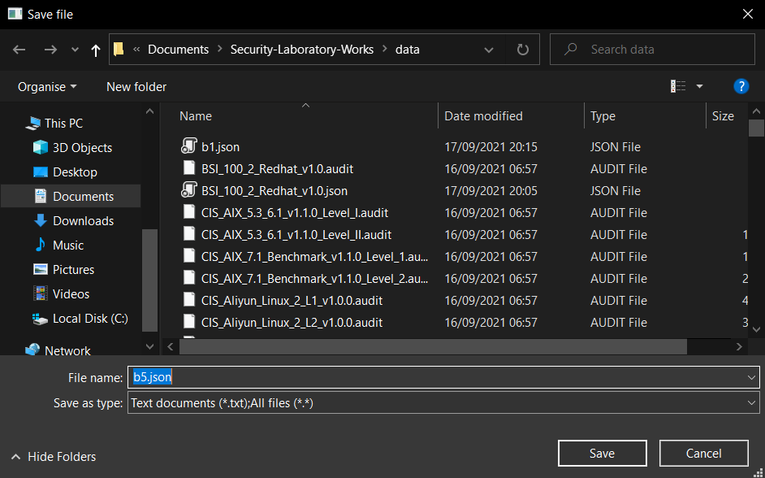
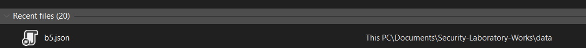
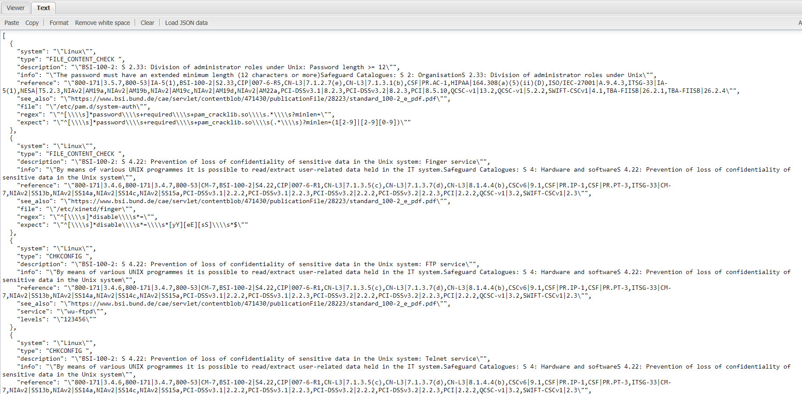

# Security-Laboratory-Works

### Laboratory Work 1:

Created a GUI:

  - Commands: Open File, Save, Save As, Copy, Cut, Undo, Redo, Paste;
  - Parsing function based on regex

Reading the audit file:

Save json:

Confirming the results by checking the json file in a json viewer online:

### Laboratory Work Nr. 3

Audit file check:

Code snippet:

  Also, there is the logic in the scrips main.py you can find the whole logic behind Audit Workstation Page
  that is too big to be included in here.
  

### Laboratory Work Nr. 4 and 5

Audit policies enforce:

  Here, the process of checking occurs, we compare the results between the 'expected' output and real output, and see that this policies 
  were not right.
  

  
  I added some commands before, new keys and values in the dictionary before recording the video due to the process being too long.
  And by using this commands we can enforce the policies. Also, we can see the functionality of the 'Rollback' button, by checking the
  needed policies, and introducing the new key-value pair in the dictionary 'unload', we can rollback to previous settings and this will
  be shown by changing in colors, for green the policie is installed and for red it is not installed.

